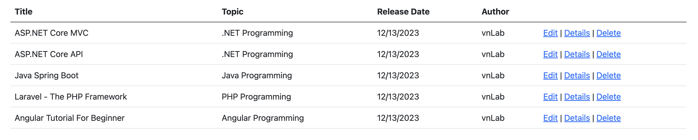

# Seed the database an ASP.NET Core MVC application

>This tutorial teaches how to seed the database, create a new class named `SeedData` in the Models folder. If there are any products in the database, the seed initializer returns and no products are added. This guide is compiled based on [Get started with ASP.NET Core MVC](https://learn.microsoft.com/en-us/aspnet/core/tutorials/first-mvc-app/start-mvc?view=aspnetcore-8.0&tabs=visual-studio-code) by `Microsoft`.

In this section:

- Seed the database Create a new class named SeedData in the Models folder.

Before coming to this guide, please refer to [Add a new field and add validation to an ASP.NET Core MVC app](https://github.com/NguyenPhuDuc307/add-field-and-validation).

## Seed the database

Create a new class named `SeedData` in the `Models` folder. Replace the generated code with the following:

```c#
using Microsoft.EntityFrameworkCore;
using Microsoft.Extensions.DependencyInjection;
using MvcProduct.Data;
using System;
using System.Linq;

namespace MVCProduct.Models;

public static class SeedData
{
    public static void Initialize(IServiceProvider serviceProvider)
    {
        using (var context = new MvcProductContext(serviceProvider.GetRequiredService<DbContextOptions<MvcProductContext>>()))
        {
            // Look for any products.
            if (context.Product.Any())
            {
                return;   // DB has been seeded
            }
            context.Product.AddRange(
                new Product
                {
                    Title = "FlavorBurst",
                    Price = 6.99M,
                    Rating = "Very Good"
                },
                new Product
                {
                    Title = "FreshBite",
                    Price = 14.99M,
                    Rating = "Good"
                },
                new Product
                {
                    Title = "SpiceMaster",
                    Price = 12.99M,
                    Rating = "Normal"
                },
                new Product
                {
                    Title = "CrunchDelight",
                    Price = 4.99M,
                    Rating = "Bad"
                },
                new Product
                {
                    Title = "When Harry Met Sally",
                    Price = 7.99M,
                    Rating = "Normal"
                },
                new Product
                {
                    Title = "BrewMasters",
                    Price = 15.99M,
                    Rating = "Good"
                }
            );
            context.SaveChanges();
        }
    }
}
``````

## Add the seed initializer

Update `Program.cs` with the following code:

```c#
using (var scope = app.Services.CreateScope())
{
    var services = scope.ServiceProvider;

    SeedData.Initialize(services);
}
```

Delete all the records in the database.

Test the app. Stop it and restart it so the `SeedData.Initialize` method runs and seeds the database.

The app shows the seeded data.



Above are all instructions on seed the database an ASP.NET Core MVC app, refer to the [Work with a database in an ASP.NET Core MVC app](https://learn.microsoft.com/en-us/aspnet/core/tutorials/first-mvc-app/working-with-sql?view=aspnetcore-8.0&tabs=visual-studio-code).
